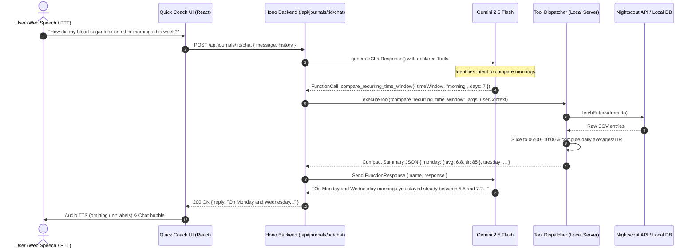

# PRD & Technical Design Document: Quick Coach Investigative Tool Calling

**Document Version:** 1.0.0  
**Status:** Implemented & Verified (All 10 tools, multi-turn tool execution loop, and local SQLite snapshot persistence complete)  
**Target Audience:** Junior / Mid-Level Software Engineers  
**Related Components:** `backend/src/lib/ai/gemini.ts`, `backend/src/lib/nightscout/client.ts`, `backend/src/routes/journal.ts`, `frontend/src/components/coach/QuickCoachVoiceNegotiation.tsx`

---

## 1. Executive Summary & Problem Statement

### 1.1 Context

In GoodNumbers, the **Quick Coach** delivers a fast, distraction-free voice and chat check-in on Friday afternoons. It presents an audio-visual data story focused on the user's single most significant recurring glycemic cluster of the week (e.g. "Post-Lunch Spikes around 13:30").

After the story plays, the user interacts with the AI coach via voice or chat to negotiate one micro-habit for the coming week.

### 1.2 The Problem

Currently, the coach is **data-blind** beyond the pre-computed 7-day primary cluster. When a user asks conversational follow-up questions during negotiation, the AI either hallucinates or gives vague non-answers:

- _"How did my blood sugar look on other mornings this week?"_ $\to$ AI: _"I only see the cluster in front of me."_
- _"Did I change my profile or basal rates this week?"_ $\to$ AI: _"I don't have access to your pump settings."_
- _"What did I bolus on days where breakfast didn't spike?"_ $\to$ AI: _"I'm not sure what you logged on other days."_

### 1.3 The Solution: Server-Side Tool Calling

Equip Gemini with a curated suite of **Investigative Tool Calls**. When the user asks investigative questions:

1. Gemini recognizes it needs external information and emits a `functionCall`.
2. The GoodNumbers backend executes the call locally via `NightscoutClient` or SQLite/Prisma.
3. The backend aggregates and condenses the data (to preserve token budgets and latency).
4. The backend returns the `functionResponse` to Gemini.
5. Gemini answers the user naturally, empathetically, and conversationally.

---

## 2. Architecture & Data Flow

### 2.1 Tool Execution Loop (Gemini Cloud + Local Function Execution)



### 2.2 Security & Privacy Guarantees

- **Credentials Never Leak**: The Nightscout URL and API token stay on the local GoodNumbers server. They are never sent in prompts or exposed to Google APIs.
- **Context Hygiene & Token Conservation**: Raw CGM feeds contain up to 288 points per day (2,016 per week). We **never** pass raw point arrays directly to Gemini. Handlers must aggregate points into lean summaries (averages, min/max, TIR%, carb/insulin sums).

---

## 3. The 10 Investigative Tool Specifications

Below are the 10 tools to be implemented. Each definition specifies:

1. **Tool Name & Purpose**
2. **Parameters (JSON Schema)**
3. **Internal Logic & Data Sources**
4. **Lean Return Schema**
5. **Example Conversational Trigger**

---

### Tool 1: `compare_recurring_time_window`

- **Trigger Question:** _"How did my blood sugar look on other mornings this week?"_ or _"Are my afternoons always this spiky?"_
- **Purpose:** Slices CGM data for a specific recurring daily window (e.g. 06:00–10:00) across recent days to determine if an excursion was an isolated event or a recurring habit.
- **Parameters:**
  ```json
  {
    "type": "object",
    "properties": {
      "timeWindow": {
        "type": "string",
        "enum": ["morning", "lunch", "afternoon", "evening", "overnight"],
        "description": "The recurring time of day to inspect (morning: 06:00-10:00, lunch: 11:30-14:30, afternoon: 14:00-18:00, evening: 18:00-22:00, overnight: 00:00-06:00)"
      },
      "customStartHour": {
        "type": "integer",
        "description": "Optional custom start hour (0-23) if not using standard enum"
      },
      "customEndHour": {
        "type": "integer",
        "description": "Optional custom end hour (0-23)"
      },
      "days": {
        "type": "integer",
        "description": "Number of past days to inspect (default: 7, max: 14)"
      }
    },
    "required": ["timeWindow"]
  }
  ```
- **Internal Logic:**
  1. Call `NightscoutClient.fetchEntries(now - days, now)`.
  2. Filter readings whose local clock time falls between `startHour` and `endHour`.
  3. Group readings by date.
  4. For each date, calculate: `meanBg`, `minBg`, `maxBg`, `timeInRangePercent`, and `trend` (`flat`, `rising`, `falling`, `spiky`).
- **Return Payload:**
  ```json
  {
    "window": "morning (06:00-10:00)",
    "daysEvaluated": 5,
    "dailyBreakdown": [
      {
        "date": "2026-09-28 (Mon)",
        "mean": 6.8,
        "min": 5.4,
        "max": 8.1,
        "tir": 92,
        "pattern": "stable"
      },
      {
        "date": "2026-09-29 (Tue)",
        "mean": 11.2,
        "min": 6.1,
        "max": 14.5,
        "tir": 45,
        "pattern": "sharp rise post-breakfast"
      }
    ],
    "consistency": "Pattern occurs primarily on weekdays"
  }
  ```

---

### Tool 2: `get_profile_and_override_history`

- **Trigger Question:** _"Did I change my profile this week?"_ or _"Was my exercise override active?"_
- **Purpose:** Checks whether changes to pump settings, basal profiles, carb ratios, or active overrides took place during the week.
- **Parameters:**
  ```json
  {
    "type": "object",
    "properties": {
      "days": {
        "type": "integer",
        "description": "Number of days back to inspect (default: 7, max: 14)"
      }
    }
  }
  ```
- **Internal Logic:**
  1. Query `NightscoutClient.fetchProfile()`.
  2. Query `NightscoutClient.fetchTreatments()` filtering for `eventType` matching `Profile Switch`, `Temp Target`, or `Override`.
- **Return Payload:**
  ```json
  {
    "activeProfileName": "Standard Autumn 2026",
    "activeBasalSummary": "0.85 u/hr daytime, 0.65 u/hr overnight",
    "recentSwitches": [
      {
        "timestamp": "2026-09-27T08:30:00Z",
        "event": "Profile Switch",
        "details": "Switched from 'Sick Day' to 'Standard Autumn 2026'"
      },
      {
        "timestamp": "2026-09-29T16:00:00Z",
        "event": "Temp Target",
        "details": "Exercise mode (Target 8.0 for 90 mins)"
      }
    ]
  }
  ```

---

### Tool 3: `find_successful_reference_days`

- **Trigger Question:** _"When was the last time I had a flat overnight?"_ or _"Show me a morning this week where breakfast didn't spike."_
- **Purpose:** Scans the last 14 days to find a "success day" matching the user's target time window, giving the coach a positive benchmark to contrast against.
- **Parameters:**
  ```json
  {
    "type": "object",
    "properties": {
      "targetWindow": {
        "type": "string",
        "enum": [
          "morning",
          "lunch",
          "afternoon",
          "evening",
          "overnight",
          "full_day"
        ]
      },
      "metric": {
        "type": "string",
        "enum": [
          "high_tir",
          "no_hypo",
          "flat_overnight",
          "minimal_post_meal_spike"
        ],
        "description": "Criteria for success"
      },
      "lookbackDays": {
        "type": "integer",
        "description": "Days to search back (default: 14)"
      }
    },
    "required": ["targetWindow", "metric"]
  }
  ```
- **Internal Logic:**
  1. Fetch CGM readings for the lookback window.
  2. Partition into candidate days.
  3. Filter days that met the criteria (e.g. overnight standard deviation $< 1.0$ mmol/L, or post-breakfast peak $< 8.5$ mmol/L).
  4. Fetch treatment logs (carbs/insulin) for the best candidate day to provide context.
- **Return Payload:**
  ```json
  {
    "foundSuccessDay": true,
    "bestDate": "2026-09-26 (Saturday)",
    "metrics": { "tir": 98, "peak": 7.4, "nadir": 5.1 },
    "whatWorked": "Logged 35g carbs at 08:15 with 3.5u bolus 15 mins prior. Glucose remained under 7.5."
  }
  ```

---

### Tool 4: `get_treatments_for_recurring_window`

- **Trigger Question:** _"What did I bolus or eat before bed on the nights I went low?"_
- **Purpose:** Inspects logged carbs, insulin boluses, and food notes across multiple days within a specific time bracket.
- **Parameters:**
  ```json
  {
    "type": "object",
    "properties": {
      "startHour": {
        "type": "integer",
        "description": "Start hour 0-23 (e.g. 21 for 9 PM)"
      },
      "endHour": {
        "type": "integer",
        "description": "End hour 0-23 (e.g. 24 for midnight)"
      },
      "days": {
        "type": "integer",
        "description": "Past days to search (default: 7)"
      },
      "treatmentType": {
        "type": "string",
        "enum": ["all", "carbs", "insulin", "notes"]
      }
    },
    "required": ["startHour", "endHour"]
  }
  ```
- **Internal Logic:**
  1. Query `NightscoutClient.fetchTreatments(now - days, now)`.
  2. Filter by hour of day `[startHour, endHour)`.
  3. Return chronological summary list grouped by day.
- **Return Payload:**
  ```json
  {
    "timeWindow": "21:00 - 24:00",
    "treatmentsByDay": [
      { "date": "2026-09-28", "carbs": 25, "notes": "popcorn", "bolus": 1.5 },
      {
        "date": "2026-09-29",
        "carbs": 0,
        "notes": "",
        "bolus": 0.8,
        "type": "correction"
      }
    ]
  }
  ```

---

### Tool 5: `check_day_of_week_pattern`

- **Trigger Question:** _"Does this spike always happen on Mondays?"_ or _"Are my weekends behaving differently than weekdays?"_
- **Purpose:** Aggregates glycemic data by weekday vs weekend or specific days of the week to reveal routine-driven differences.
- **Parameters:**
  ```json
  {
    "type": "object",
    "properties": {
      "comparisonType": {
        "type": "string",
        "enum": ["weekday_vs_weekend", "day_of_week", "specific_day"],
        "description": "How to group days"
      },
      "specificDay": {
        "type": "string",
        "enum": [
          "Monday",
          "Tuesday",
          "Wednesday",
          "Thursday",
          "Friday",
          "Saturday",
          "Sunday"
        ],
        "description": "If specific_day comparison selected"
      },
      "lookbackWeeks": {
        "type": "integer",
        "description": "Number of weeks to evaluate (default: 3, max: 4)"
      }
    },
    "required": ["comparisonType"]
  }
  ```
- **Return Payload:**
  ```json
  {
    "comparison": "weekday_vs_weekend",
    "weekday": { "tir": 74, "mean": 7.8, "cv": 32 },
    "weekend": { "tir": 58, "mean": 9.4, "cv": 44 },
    "keyObservation": "Weekend mornings show an average waking time 2 hours later with 3.2 mmol/L higher dawn rise."
  }
  ```

---

### Tool 6: `get_post_meal_peak_trends`

- **Trigger Question:** _"How high do I usually peak after breakfast?"_ or _"How long does it take me to come down after dinner?"_
- **Purpose:** Evaluates the postprandial 2–3 hour glucose excursion curve following a meal time.
- **Parameters:**
  ```json
  {
    "type": "object",
    "properties": {
      "meal": {
        "type": "string",
        "enum": ["breakfast", "lunch", "dinner"]
      },
      "days": {
        "type": "integer",
        "description": "Past days to inspect (default: 7)"
      }
    },
    "required": ["meal"]
  }
  ```
- **Return Payload:**
  ```json
  {
    "meal": "lunch",
    "averagePreMealBg": 6.2,
    "averagePeakBg": 11.4,
    "averageRise": 5.2,
    "averageTimeToPeakMinutes": 75,
    "returnedToTargetWithin3Hours": "2 out of 5 days"
  }
  ```

---

### Tool 7: `search_treatment_notes`

- **Trigger Question:** _"Did I log any workouts or stress notes this week?"_ or _"When did I last log alcohol?"_
- **Purpose:** Scans Nightscout treatment logs for keyword strings.
- **Parameters:**
  ```json
  {
    "type": "object",
    "properties": {
      "query": {
        "type": "string",
        "description": "Keyword to search (e.g. gym, walk, stress, beer, sick)"
      },
      "days": {
        "type": "integer",
        "description": "Days back to search (default: 14)"
      }
    },
    "required": ["query"]
  }
  ```
- **Return Payload:**
  ```json
  {
    "query": "walk",
    "matchesCount": 3,
    "entries": [
      {
        "timestamp": "2026-09-29T13:45:00Z",
        "note": "15 min walk after lunch",
        "glucoseAtTime": 8.2
      },
      {
        "timestamp": "2026-09-27T19:30:00Z",
        "note": "Evening dog walk",
        "glucoseAtTime": 6.5
      }
    ]
  }
  ```

---

### Tool 8: `get_temp_basal_and_suspends`

- **Trigger Question:** _"Was my pump giving extra insulin last night?"_ or _"Did my pump suspend before that morning rebound?"_
- **Purpose:** Queries automated loop temp basals or pump suspensions to understand if automated delivery played a role.
- **Parameters:**
  ```json
  {
    "type": "object",
    "properties": {
      "startDate": {
        "type": "string",
        "description": "ISO timestamp or YYYY-MM-DD"
      },
      "endDate": {
        "type": "string",
        "description": "ISO timestamp or YYYY-MM-DD"
      }
    },
    "required": ["startDate", "endDate"]
  }
  ```
- **Return Payload:**
  ```json
  {
    "totalSuspendedMinutes": 45,
    "highTempBasalMinutes": 120,
    "automatedInsulinDelivered": 4.2,
    "summary": "Pump suspended delivery from 03:15 to 04:00 due to predicted low, followed by increased basal from 04:30."
  }
  ```

---

### Tool 9: `get_daily_insulin_and_carb_trends`

- **Trigger Question:** _"Have I been eating more carbs or giving bigger corrections this week?"_
- **Purpose:** Compares total daily insulin (TDD), basal vs bolus breakdown, and total carbs logged day by day.
- **Parameters:**
  ```json
  {
    "type": "object",
    "properties": {
      "days": {
        "type": "integer",
        "description": "Number of days (default: 7)"
      }
    }
  }
  ```
- **Return Payload:**
  ```json
  {
    "averageDailyCarbs": 165,
    "averageDailyInsulin": 42.5,
    "basalPercentage": 48,
    "bolusPercentage": 52,
    "trend": "Carb intake increased by 25g/day on Thursday and Friday with higher correction bolus volume."
  }
  ```

---

### Tool 10: `inspect_prior_context`

- **Trigger Question:** _"What happened right before that afternoon crash yesterday?"_ or _"Did I have a late snack before that high wake-up?"_
- **Purpose:** Inspects a tight 4-to-6 hour window immediately preceding a specific event or timestamp.
- **Parameters:**
  ```json
  {
    "type": "object",
    "properties": {
      "targetTimestamp": {
        "type": "string",
        "description": "The timestamp of the event (ISO string)"
      },
      "lookbackHours": {
        "type": "integer",
        "description": "Hours to look back before the event (default: 4, max: 8)"
      }
    },
    "required": ["targetTimestamp"]
  }
  ```
- **Return Payload:**
  ```json
  {
    "targetTimestamp": "2026-09-29T15:30:00Z",
    "startingBgAtLookback": 6.1,
    "interveningTreatments": [
      { "time": "13:00", "carbs": 60, "bolus": 6.0 },
      { "time": "14:15", "bolus": 2.0, "notes": "Correction for 11.2" }
    ],
    "glucoseTrajectory": "Rose from 6.1 to 12.0 at 14:10, then dropped sharply to 3.8 at 15:30",
    "clinicalObservation": "Stacking correction bolus 75 minutes after meal bolus while insulin was still active."
  }
  ```

---

## 4. Implementation Blueprint (Step-by-Step for Junior Engineers)

### Directory & File Structure

```
backend/src/lib/ai/
├── gemini.ts                        <-- Update generateChatResponse to run tool loop
├── prompts.ts                       <-- Prompt guidance for tool calling
└── tools/
    ├── index.ts                     <-- Re-exports definitions and dispatcher
    ├── declarations.ts              <-- Gemini FunctionDeclaration schemas
    ├── dispatcher.ts                <-- Dispatches call to correct handler with timeout
    └── handlers/
        ├── compareTimeWindow.ts     <-- Tool 1
        ├── profileOverrides.ts      <-- Tool 2
        ├── referenceDays.ts         <-- Tool 3
        ├── recurringTreatments.ts   <-- Tool 4
        ├── dayOfWeekPattern.ts      <-- Tool 5
        ├── postMealPeaks.ts         <-- Tool 6
        ├── searchNotes.ts           <-- Tool 7
        ├── tempBasals.ts            <-- Tool 8
        ├── insulinCarbTrends.ts     <-- Tool 9
        └── priorContext.ts          <-- Tool 10
```

---

### 4.1 Step 1: Tool Declaration Schema (`declarations.ts`)

Create `declarations.ts` defining each tool using the standard Gemini SDK function declaration format:

```typescript
import { FunctionDeclaration, SchemaType } from "@google/generative-ai";

export const COACH_INVESTIGATIVE_TOOLS: FunctionDeclaration[] = [
  {
    name: "compare_recurring_time_window",
    description:
      "Compares blood sugar readings for a specific recurring daily time window (e.g. morning, lunch, overnight) across the last 3-14 days to identify patterns or anomalies.",
    parameters: {
      type: SchemaType.OBJECT,
      properties: {
        timeWindow: {
          type: SchemaType.STRING,
          description:
            "recurring window: morning, lunch, afternoon, evening, overnight",
          format: "enum",
          enum: ["morning", "lunch", "afternoon", "evening", "overnight"],
        },
        days: {
          type: SchemaType.INTEGER,
          description: "Number of past days to inspect (default: 7)",
        },
      },
      required: ["timeWindow"],
    },
  },
  // ... remaining 9 tools ...
];
```

---

### 4.2 Step 2: The Dispatcher (`dispatcher.ts`)

The dispatcher inspects incoming `functionCall`, instantiates or utilizes `NightscoutClient`, and executes the corresponding handler with safety guarantees:

```typescript
import { NightscoutClient } from "../nightscout/client.js";

export interface ToolExecutionContext {
  userId: string;
  preferredUnits: "mmol/L" | "mg/dL";
  nsClient: NightscoutClient;
}

export async function dispatchToolCall(
  name: string,
  args: Record<string, any>,
  context: ToolExecutionContext,
): Promise<Record<string, any>> {
  const TIMEOUT_MS = 8000; // 8-second circuit breaker

  const timeoutPromise = new Promise<never>((_, reject) =>
    setTimeout(
      () => reject(new Error(`Tool ${name} timed out after ${TIMEOUT_MS}ms`)),
      TIMEOUT_MS,
    ),
  );

  const executionPromise = (async () => {
    switch (name) {
      case "compare_recurring_time_window":
        return await handleCompareTimeWindow(args, context);
      case "get_profile_and_override_history":
        return await handleProfileOverrides(args, context);
      case "find_successful_reference_days":
        return await handleReferenceDays(args, context);
      // ... cases for all 10 tools ...
      default:
        throw new Error(`Unknown tool: ${name}`);
    }
  })();

  return await Promise.race([executionPromise, timeoutPromise]);
}
```

---

### 4.3 Step 3: Multi-Turn Execution Loop in `generateChatResponse`

Update `generateChatResponse()` in `backend/src/lib/ai/gemini.ts` to support tool calling.

```typescript
export async function generateChatResponse(
  cluster: GlycemicCluster,
  deterministicInsights: Insight[],
  preferredUnits: GlucoseUnit,
  weeklyContext: { vibe: string | null; factors: string },
  chatHistory: ChatMessage[],
  newMessage: string,
  userContext?: { userId: string; nsClient?: NightscoutClient },
): Promise<string> {
  const apiKey = process.env.GEMINI_API_KEY;
  if (!apiKey) return "I'm sorry, AI features are offline.";

  // Initialize model with tools enabled
  const modelWithTools = genAI.getGenerativeModel({
    model: "gemini-2.5-flash",
    tools: userContext?.nsClient
      ? [{ functionDeclarations: COACH_INVESTIGATIVE_TOOLS }]
      : undefined,
  });

  const chat = modelWithTools.startChat({
    history: buildGeminiChatHistory(
      cluster,
      deterministicInsights,
      preferredUnits,
      weeklyContext,
      chatHistory,
    ),
  });

  let response = await chat.sendMessage(newMessage);
  let iterations = 0;
  const MAX_TOOL_ITERATIONS = 3; // Safety bound against infinite tool loops

  while (
    response.response.functionCalls()?.length &&
    iterations < MAX_TOOL_ITERATIONS
  ) {
    iterations++;
    const functionCalls = response.response.functionCalls()!;
    const functionResponses = [];

    for (const call of functionCalls) {
      try {
        const result = await dispatchToolCall(call.name, call.args, {
          userId: userContext!.userId,
          preferredUnits,
          nsClient: userContext!.nsClient!,
        });
        functionResponses.push({
          response: { name: call.name, content: result },
        });
      } catch (err) {
        functionResponses.push({
          response: {
            name: call.name,
            content: { error: (err as Error).message },
          },
        });
      }
    }

    // Feed tool results back into Gemini
    response = await chat.sendMessage(functionResponses as any);
  }

  return response.response.text().trim();
}
```

---

## 5. Guardrails & Formatting Rules

### 5.1 The "No Units in Speech" Rule

- **Clinical & UX Constraint:** Voice synthesis reads `6.3 mmol/L` awkwardly as _"six point three millimoles per liter"_.
- **Instruction:** All Gemini responses must use naked numbers (`6.3` or `115`) without unit suffixes.
- **Prompt Rule:** In `CLUSTER_AI_CHAT_PROMPT`, maintain the explicit instruction:
  ```
  CRITICAL SPEECH RULE: Do NOT speak unit symbols (e.g. say "6.3" instead of "6.3 mmol/L", or "120" instead of "120 mg/dL").
  ```

### 5.2 Unit Normalization

- Internally, Nightscout stores SGV values in `mg/dL`.
- If `preferredUnits === 'mmol/L'`, the tool handlers must convert values before returning the JSON payload:
  $$\text{mmol/L} = \frac{\text{mg/dL}}{18.0182}$$
  Rounded to 1 decimal place.

### 5.3 Error Handling & Fallbacks

If Nightscout is unreachable or returns 401:

- The tool handler returns `{ error: "Nightscout connection failed" }`.
- Gemini should politely inform the user without technical jargon: _"I wasn't able to check your past days right now because the Nightscout connection timed out. Let's focus on what we see in this cluster."_

---

## 6. Testing & Quality Assurance Plan (TDD Red/Green)

A junior engineer must implement this feature using strict **Red $\to$ Green $\to$ Refactor**:

### 6.1 Unit Tests

1. **`declarations.test.ts`**:
   - Verify all 10 schemas compile and match Gemini SDK `FunctionDeclaration` types.
   - Verify every tool has non-empty descriptions and valid parameter schemas.
2. **`handlers/*.test.ts`**:
   - Mock `NightscoutClient` methods (`fetchEntries`, `fetchTreatments`, `fetchProfile`).
   - Test `compareTimeWindow`:
     - Test window filtering (e.g. 06:00 to 10:00).
     - Test unit conversion (`mg/dL` $\to$ `mmol/L`).
     - Test empty response handling (sensor gaps).
   - Test `profileOverrides`:
     - Test correct parsing of profile switch events.

### 6.2 Integration Tests

1. **`gemini_tool_loop.test.ts`**:
   - Mock Gemini `sendMessage` to simulate:
     - Turn 1: Gemini emits `functionCall: compare_recurring_time_window`.
     - Turn 2: Backend returns `functionResponse`.
     - Turn 3: Gemini returns final text answer.
   - Assert `dispatchToolCall` was invoked with expected parameters.
   - Assert total iterations do not exceed `MAX_TOOL_ITERATIONS`.

### 6.3 Verification Checklist

- [ ] All 10 tools implemented and covered by unit tests.
- [ ] No regression in existing `journalChatRoutes.test.ts` and `gemini_chat.test.ts`.
- [ ] Fast execution: Handlers complete data aggregation in $< 200\text{ms}$.
- [ ] Voice TTS clean: Verify AI replies never include `mmol/L` or `mg/dL`.
- [ ] `npm test` passes 100% across all backend and frontend suites.
