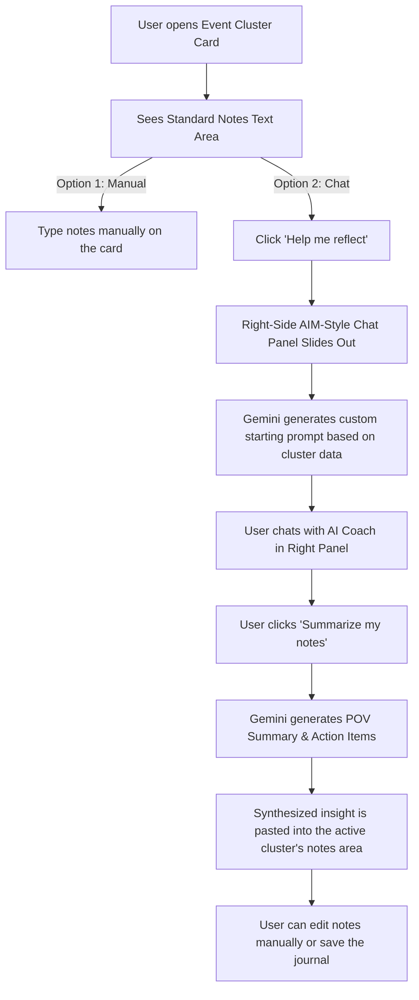

# PRD: Journal Overhaul — Collaborative AI Chat Insights

**Status:** Approved Draft (Refined with right-panel UX feedback)
**Date:** June 17, 2026

## 1. Overview & Objectives

Currently, the weekly health journal generates static AI assessments for each glycemic event cluster. The patient then uses a plain text area to type their own reflections and notes.

We want to transform this passive reflection into an active, collaborative, and conversational experience:

1. **Hybrid Note Entry with Right-Side Chat Panel:** Keep the standard notes text area (`CollapsingNoteArea`) visible and editable directly on the cluster card. Add a **"💡 Help me reflect"** button underneath the text area.
2. **Persistent Side Panel Chat Drawer:** Clicking the button opens a right-side flyout panel (reminiscent of an old-school instant messenger chat window) rather than replacing the notes box on the card itself.
3. **Context-Specific Prompts:** When activated, the AI assistant in the right panel initiates the chat with a dynamically generated question tailored specifically to the data in that cluster.
4. **Coaching/Interviewing Agent:** The agent acts as an empathetic, collaborative professional diabetes coach, helping the user dissect the trend through a back-and-forth dialogue.
5. **Summarize my notes:** A button in the right-side panel compiles the conversation history, sends it to Gemini for synthesis, and automatically inserts (pastes) the resulting first-person POV summary and action items directly into the notes text box of the active cluster.
6. **Dynamic Context Switching:** If the user clicks on a "💡 Help me reflect" button for a _different_ cluster while the panel is open, the right panel automatically switches focus, resetting the chat session for the new cluster and targeting the new cluster's notes box.

---

## 2. Customer Journey & Core Interactions

### Phase A: Default Manual State

- The cluster card displays the chart, deterministic insights, and the AI Co-pilot assessment.
- Below the assessment, a standard text area (`CollapsingNoteArea`) is visible for manual note-taking.
- A prominent button **"💡 Help me reflect"** is displayed next to or below the text area.

### Phase B: Activating Right-Side Chat Panel

- Clicking **"Help me reflect"** opens a drawer/side-panel sliding from the right edge of the screen. The text area on the card remains visible and unchanged.
- The right panel shows the **AI Reflection Coach** chat layout.
- The client sends a request to the backend to generate a **Dynamic Starting Prompt** based on the cluster details (timing, event count, timezone, deterministic insights) if the chat for this cluster is starting.
- The AI coach starts the chat with this prompt.
- The user and AI engage in dialogue. The chat history is kept in **temporary client-side memory** (or temporary session state) for simplicity and privacy.
- If the user clicks "💡 Help me reflect" on a _new_ cluster card:
  - The right-side chat panel updates to reference the new cluster.
  - The chat history is reset/cleared for the new session, and a new dynamic starting prompt is loaded.

### Phase C: Insight Synthesis & Persistence

- A **"Summarize my notes"** button is displayed at the bottom of the chat panel.
- When clicked, the chat history is sent to Gemini to synthesize:
  - **POV Summary:** A 1-2 sentence recap from the patient's perspective.
  - **Action Items / Resolutions:** A list of 1-3 concrete adjustments.
- The backend returns this synthesized text as a single formatted markdown string.
- The client-side application inserts this text directly into the `userNotes` text area of the _active_ cluster card, updating the parent form state.
- The user can make manual edits to the notes box or close the chat drawer when finished.

---

## 3. Proposed Technical Architecture & API Changes

### 3.1 Data Model (Prisma Schema)

No database migrations or schema modifications are required. The transient chat history exists purely in the frontend React state, and the resulting summary is saved into the existing `userNotes` column in `GlycemicEventCluster`.

### 3.2 API Endpoints

1. **`POST /api/journals/:id/clusters/:clusterId/chat`**
   - **Request:** `{ message: string, chatHistory: Message[] }` (client passes transient chat history)
   - **Operation:** Calls Gemini with cluster data + current chat history to generate the next response.
   - **Response:** `{ reply: string }`

2. **`POST /api/journals/:id/clusters/:clusterId/save-insight`**
   - **Request:** `{ chatHistory: Message[] }`
   - **Operation:** Calls Gemini to synthesize the chat history into a formatted POV summary and action items.
   - **Response:** `{ synthesizedInsight: string }`

---

## 4. Design Aesthetics & UI Experience

Following our **Rich Aesthetics** principles:

- **Sidebar Drawer Layout:** A fixed right-side panel (`w-[380px] sm:w-[420px] h-screen fixed right-0 top-0 shadow-2xl bg-white border-l border-gray-200 z-50 transition-transform duration-300`).
- **AIM-style Messaging Feed:**
  - Balloons bubble on top of the text entry.
  - AI messages: Left-aligned, light Petrol Blue background (`bg-blue-50/70` / `border-blue-100`).
  - User messages: Right-aligned, solid `bg-mesa-primary` (Terracotta) with `text-white`.
- **Active Context Highlighting:** When a cluster's chat is active, the corresponding card on the page can have a subtle highlight border (e.g., pulsing border) to clearly show which card is currently being updated.
- **Pulsing Loading State:** A clean, pulsing typing indicator when waiting for AI responses.
- **Insert Flash:** When clicking "Summarize my notes", the summary text is populated into the note textarea, and the textarea performs a brief green outline pulse/flash to confirm the insert.
