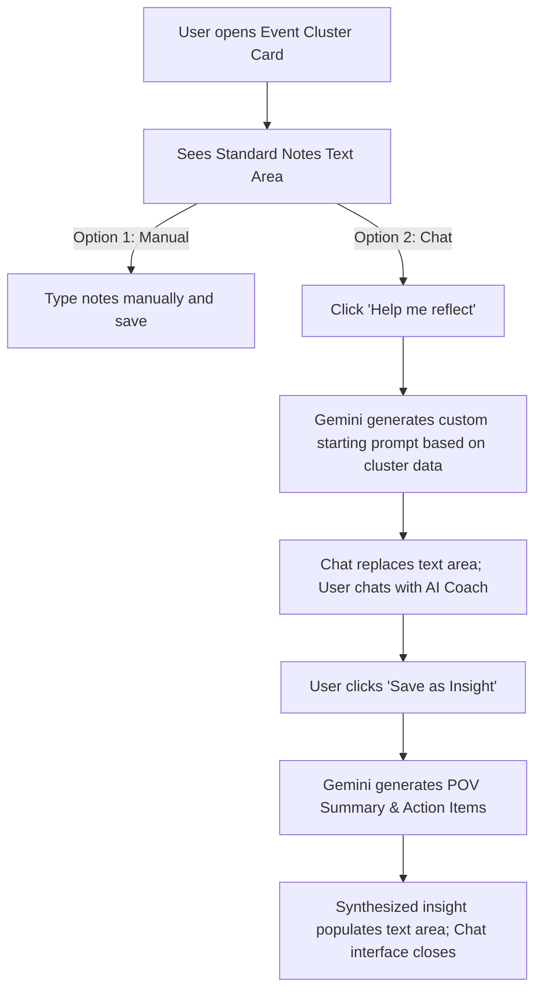

# PRD: Journal Overhaul — Collaborative AI Chat Insights

**Status:** Approved Draft (Refined with user feedback)
**Date:** June 16, 2026

## 1. Overview & Objectives

Currently, the weekly health journal generates static AI assessments for each glycemic event cluster. The patient then uses a plain text area to type their own reflections and notes.

We want to transform this passive reflection into an active, collaborative, and conversational experience:

1. **Hybrid Note Entry:** Default to the standard notes text area (so users can quickly type notes manually). Add a **"💡 Help me reflect"** button that activates the AI chat assistant.
2. **Context-Specific Prompts:** When activated, the AI assistant initiates the chat with a dynamically generated question tailored specifically to the data in that cluster (e.g., instead of a generic "how can you improve?", it might ask, "I notice spikes around 8:00 AM on school days, but not weekends. Does your school day breakfast or commute affect your insulin timing?").{>>Rather than a specific diagnostic question, it should be more exploratory? ie, "Why do you think that...?"<<}
3. **Coaching/Interviewing Agent:** The agent acts as an empathetic, collaborative professional diabetes healthcare professional BUT NEVER CLAIMS TO BE ONE, helping the user dissect the trend through a back-and-forth dialogue.
4. **Structured "Save as Insight" Synthesis:** Once the user is satisfied, they click a "Save as Insight" button. The AI synthesizes the chat into a structured reflection written from the patient's POV, along with actionable resolutions/action items, and populates this text directly into the standard notes text area, saving to the database.
5. The user can edit the note at any time.

---

## 2. Customer Journey & Core Interactions

### Phase A: Default Manual State

- The cluster card displays the chart, deterministic insights, and the AI Co-pilot assessment.
- Below the assessment, a standard text area (`CollapsingNoteArea`) is visible for manual note-taking.
- A prominent button **"💡 Help me reflect"** is displayed next to or below the text area.

### Phase B: Activating Collaborative Interviewing

- Clicking **"Help me reflect"** replaces the text area with an **Interactive Chat Pane**.
- The client sends a request to the backend to generate a **Dynamic Starting Prompt** based on the cluster details (timing, event count, timezone, deterministic insights).{>>We should include the data as well?<<}
- The AI coach starts the chat with this prompt.
- The user and AI engage in dialogue. The chat history is kept in **temporary client-side memory** (or temporary session state) for simplicity and privacy.
- The AI coach:
  - Remains encouraging, non-judgmental, and medically safe (never prescribing medication/doses).
  - Asks clarifying questions (e.g., "Did you dose before or after the meal?", "How did that exercise session feel?").
  - Guides the user toward articulating their own insights.

### Phase C: Insight Synthesis & Persistence

- A **"Save as Insight"** button is displayed in the chat pane.
- When clicked, the chat history is sent to Gemini to synthesize:
  - **POV Summary:** A 1-2 sentence recap from the patient's perspective.
  - **Action Items / Resolutions:** A list of 1-3 concrete adjustments.
- The backend returns this synthesized text as a single formatted markdown string (e.g., combining the summary and action items).
- The client-side application populates this string directly into the `userNotes` text area, updates the state, saves it to the database, and closes the chat pane (returning to the standard text area view).

---

## 3. Proposed Technical Architecture & API Changes

### 3.1 Data Model (Prisma Schema)

Because the chat history is transient and the final insight is saved back into the existing `userNotes` column on `GlycemicEventCluster`, **no database migrations or schema modifications are required.** This drastically simplifies implementation and maintains 100% backward compatibility with all downstream features (e.g. podcasts, historical views).

### 3.2 API Endpoints

1. **`POST /api/journals/:id/clusters/:clusterId/start-prompt`**
   - **Request:** None
   - **Operation:** Calls Gemini to generate a context-specific starting question based on the cluster data.
   - **Response:** `{ prompt: string }`

2. **`POST /api/journals/:id/clusters/:clusterId/chat`**
   - **Request:** `{ message: string, chatHistory: Message[] }` (client passes transient chat history)
   - **Operation:** Calls Gemini with cluster data + current chat history to generate the next response.
   - **Response:** `{ reply: string }`

3. **`POST /api/journals/:id/clusters/:clusterId/save-insight`**
   - **Request:** `{ chatHistory: Message[] }`
   - **Operation:** Calls Gemini to synthesize the chat history into a formatted POV summary and action items.
   - **Response:** `{ synthesizedInsight: string }`

---

## 4. Design Aesthetics & UI Experience

Following our **Rich Aesthetics** principles:

- **Chat Transition:** Clicking "Help me reflect" should smoothly slide/morph the text area into the chat panel with a subtle micro-animation.
- **Chat Bubbles:** Soft, warm colors adhering to the Mesa theme (e.g., `#F4F1EA` for patient bubbles, light Petrol Blue borders for AI coach messages).
- **Loading States:** A clean, pulsing typing indicator when waiting for AI replies.
- **Success Animation:** A green checkmark fading out when the synthesized insight is populated back into the text area.
