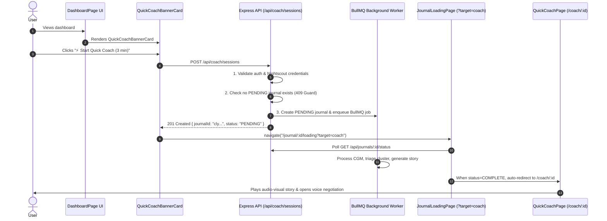

# Implementation Guide: On-Demand Quick Coach Dashboard Trigger

**Target Audience:** Junior / Mid-Level Software Engineers  
**Project:** GoodNumbers "Quick Coach"  
**Specification:** On-Demand Coaching Session Initiation (`POST /api/coach/sessions`)  
**Workflow Standard:** Strict TDD (Red $\to$ Green $\to$ Refactor) with explicit manual testing checkpoints.

---

## 1. Executive Summary & Architecture

This guide details how to build an on-demand trigger for the **Quick Coach** experience directly from the user's dashboard.

Currently, Quick Coach can be triggered via CLI (`npm run trigger:coaching`) or the weekly worker scheduler. This feature gives logged-in users an instant UI button to analyze their last 7 days of CGM data and transition directly into the audio-visual coaching session.

### End-to-End User Flow



---

## 2. Invariants & Guardrails

1. **RESTful Resource Modeling**: We use `POST /api/coach/sessions` to represent creating a new coaching session resource.
2. **Double-Trigger Guard (409 Conflict)**: A user cannot start a new coaching session if they already have a journal with `status: 'PENDING'`.
3. **Prerequisite Check (400 Bad Request)**: Users must have valid Nightscout credentials (`nightscoutUrl` and `nightscoutToken`). If not configured, reject with a user-friendly error message directing them to `/setup`.
4. **Queue Rollback Safety**: If BullMQ fails to enqueue the job, the created journal database record must be immediately deleted so no orphaned pending records block future runs.
5. **Strict TDD Enforcement**: Every phase starts by creating or updating failing test files (`.test.ts` / `.test.tsx`). You must execute tests and see them fail (**RED**) before writing application code (**GREEN**).

---

## 3. Step-by-Step Implementation Playbook

---

### Phase 1: Backend Endpoint (`POST /api/coach/sessions`)

#### 1.1 RED Phase — Write Integration Tests

Create `backend/tests/integration/coachSessionsRoute.test.ts`:

- **Test Suite Requirements**:
  1. `401 Unauthorized`: Calling without authentication returns 401.
  2. `400 Bad Request`: If the user has no `nightscoutUrl` or `nightscoutToken`, returns 400 with `{ error: "Nightscout credentials required to start a coaching session. Please configure them in Settings." }`.
  3. `409 Conflict`: If the user already has a journal with `status: 'PENDING'`, returns 409 with `{ error: "A session is already in progress. Please wait for it to complete." }`.
  4. `201 Created`: When valid:
     - Creates a `Journal` record with `startDate = now - 7 days`, `endDate = now`, and `status = 'PENDING'`.
     - Enqueues a `process-journal` job to BullMQ `journal-processing` queue with `{ journalId }`.
     - Returns `{ journalId: string, status: "PENDING" }`.
  5. `Rollback on Enqueue Failure`: If `queue.add()` rejects, ensure the created journal is deleted from Prisma and returns 500.

**Execute Red Test**:

```bash
npx vitest backend/tests/integration/coachSessionsRoute.test.ts
```

_Expected Result:_ Test fails because `/api/coach/sessions` route is not found (404).

---

#### 1.2 GREEN Phase — Implementation

1. **Create Route Handler**: `backend/src/routes/coach.ts`:
   - Initialize Express `Router()`.
   - Implement `router.post('/sessions', async (req, res, next) => { ... })`:
     - Extract `userId = req.user!.id`.
     - Fetch user from Prisma: check `nightscoutUrl` and `nightscoutToken`. Return 400 if missing.
     - Query existing pending journal:
       ```ts
       const activePending = await prisma.journal.findFirst({
         where: { userId, status: "PENDING" },
       });
       if (activePending) {
         return res
           .status(409)
           .json({ error: "A session is already in progress." });
       }
       ```
     - Compute 7-day window:
       ```ts
       const now = new Date();
       const startDate = new Date(now.getTime() - 7 * 24 * 60 * 60 * 1000);
       ```
     - Create journal with `status: 'PENDING'`.
     - Enqueue job: `await getJournalQueue().add('process-journal', { journalId: journal.id })`.
     - If enqueue throws, catch error, run `await prisma.journal.delete({ where: { id: journal.id } })`, and call `next(error)`.
     - Return `res.status(201).json({ journalId: journal.id, status: 'PENDING' })`.
2. **Mount Route in App**: In `backend/src/index.ts`:
   - Import `coachRoutes` from `./routes/coach.js`.
   - Mount under authenticated middleware:
     ```ts
     app.use(
       "/api/coach",
       protect,
       csrfProtection,
       enforceAgreements,
       enforceAccountSetup,
       coachRoutes,
     );
     ```

**Execute Verification**:

```bash
npx vitest backend/tests/integration/coachSessionsRoute.test.ts
```

_Expected Result:_ 100% tests pass.

---

#### 📍 Natural Manual Testing Checkpoint 1

Verify the endpoint directly using your terminal:

1. Ensure Docker/Redis and the backend server are running:
   ```bash
   npm run dev:backend
   ```
2. In another terminal, inspect BullMQ queue jobs using `redis-cli`:
   ```bash
   redis-cli monitor | grep "journal-processing"
   ```
3. Send an authenticated request using session cookies or test credentials. Observe that a 201 is returned and the BullMQ job is immediately printed in the monitor output.
4. Fire a second request immediately and confirm you receive HTTP 409 Conflict.

---

### Phase 2: Navigation & Target Routing (`JournalLoadingPage.tsx`)

#### 2.1 RED Phase — Update Loading Page Test

Open or create `frontend/src/pages/__tests__/JournalLoadingPage.test.tsx`:

- Test that when status transitions to `COMPLETE`:
  - If URL has `?target=coach`, it navigates to `/coach/:journalId`.
  - If URL has no `target` or `?target=journal`, it navigates to `/journal/:journalId`.

**Execute Red Test**:

```bash
npx vitest frontend/src/pages/__tests__/JournalLoadingPage.test.tsx
```

_Expected Result:_ Fails because `JournalLoadingPage` currently always navigates to `/journal/${journalId}`.

---

#### 2.2 GREEN Phase — Implementation

In `frontend/src/pages/JournalLoadingPage.tsx`:

1. Import `useSearchParams` from `react-router-dom`:
   ```tsx
   import { useParams, useNavigate, useSearchParams } from "react-router-dom";
   ```
2. Read the search param:
   ```tsx
   const [searchParams] = useSearchParams();
   const target = searchParams.get("target");
   ```
3. Update the completion effect:
   ```tsx
   useEffect(() => {
     if (status === "COMPLETE") {
       const destination =
         target === "coach" ? `/coach/${journalId}` : `/journal/${journalId}`;
       navigate(destination, { replace: true });
     }
   }, [status, journalId, navigate, target]);
   ```

**Execute Verification**:

```bash
npx vitest frontend/src/pages/__tests__/JournalLoadingPage.test.tsx
```

_Expected Result:_ 100% tests pass.

---

#### 📍 Natural Manual Testing Checkpoint 2

Verify loading routing in the browser:

1. Start frontend: `npm run dev:frontend`.
2. Grab an existing completed journal ID from your DB.
3. Open in your browser: `http://localhost:3000/journal/<completed-id>/loading?target=coach`.
4. Observe that the page immediately detects `status === "COMPLETE"` and cleanly redirects to `http://localhost:3000/coach/<completed-id>`.

---

### Phase 3: Frontend Component (`QuickCoachBannerCard.tsx`)

#### 3.1 RED Phase — Create Component Tests

Create `frontend/src/components/dashboard/__tests__/QuickCoachBannerCard.test.tsx`:

- **Test Cases**:
  1. **Idle State**: Renders title "Quick Coach", description, and button "⚡ Start Quick Coach (3 min)".
  2. **Disabled State**: When `isProcessing={true}` prop is passed, the button is disabled and displays "Session in progress...".
  3. **Trigger Action**: Clicking the button calls `api.post("/coach/sessions")`.
  4. **Submitting State**: While request is in-flight, button shows spinner and "Starting...".
  5. **Successful Navigation**: On 201 response with `{ journalId: "xyz" }`, calls `navigate("/journal/xyz/loading?target=coach")`.
  6. **Error Handling**: When API responds with error message (e.g. missing Nightscout), displays the error string to the user.

**Execute Red Test**:

```bash
npx vitest frontend/src/components/dashboard/__tests__/QuickCoachBannerCard.test.tsx
```

_Expected Result:_ Fails with module not found.

---

#### 3.2 GREEN Phase — Implementation

Create `frontend/src/components/dashboard/QuickCoachBannerCard.tsx`:

- **UI & Layout Guidelines**:
  - Standalone rounded card using Tailwind and Mesa design tokens (`bg-mesa-bg/40`, `border-mesa-primary/20`, `text-mesa-primary`).
  - Lucide icons: `Sparkles` or `Zap` for icon accent, `Loader2` for loading state.
  - Headline: _"Quick Coach: 3-Minute Glycemic Debrief"_.
  - Subhead: _"Distill your last 7 days of CGM data into a single high-impact pattern with an audio breakdown and micro-habit negotiation."_
  - Action button:
    ```tsx
    <button
      onClick={handleStartCoach}
      disabled={isProcessing || isSubmitting}
      className="px-5 py-2.5 bg-mesa-primary text-white font-semibold rounded-lg shadow-sm hover:bg-primary-hover transition-colors disabled:opacity-50 disabled:cursor-not-allowed flex items-center justify-center"
    >
      {isSubmitting ? (
        <>
          <Loader2 className="animate-spin w-4 h-4 mr-2" />
          Preparing...
        </>
      ) : isProcessing ? (
        "Session in progress..."
      ) : (
        "⚡ Start Quick Coach (3 min)"
      )}
    </button>
    ```

**Execute Verification**:

```bash
npx vitest frontend/src/components/dashboard/__tests__/QuickCoachBannerCard.test.tsx
```

_Expected Result:_ 100% tests pass.

---

### Phase 4: Dashboard Integration

#### 4.1 RED Phase — Update Dashboard Tests

In `frontend/src/pages/DashboardPage.test.tsx`:

- Add test case verifying that `QuickCoachBannerCard` is rendered on the dashboard and passes down the `isProcessing` flag based on pending journals.

**Execute Red Test**:

```bash
npx vitest frontend/src/pages/DashboardPage.test.tsx
```

---

#### 4.2 GREEN Phase — Implementation

In `frontend/src/pages/DashboardPage.tsx`:

1. Import `QuickCoachBannerCard` from `../components/dashboard/QuickCoachBannerCard`.
2. Place `<QuickCoachBannerCard isProcessing={!!pendingJournal} />` directly between `StartJournalCard` and `PastJournalsList`:
   ```tsx
   return (
     <div className="max-w-4xl mx-auto p-4 sm:p-4 lg:p-8 space-y-6">
       <StartJournalCard
         isProcessing={!!pendingJournal}
         isSubmitting={isSubmitting}
         error={creationError}
         onStart={(data) => {
           void handleStartJournal(data);
         }}
       />
       <QuickCoachBannerCard isProcessing={!!pendingJournal} />
       <PastJournalsList
         journals={historyJournals}
         onDelete={(id) => {
           void handleDeleteJournal(id);
         }}
       />
     </div>
   );
   ```

**Execute Verification**:

```bash
npx vitest frontend/src/pages/DashboardPage.test.tsx
```

_Expected Result:_ All tests pass cleanly.

---

## 4. End-to-End Manual Verification Checklist

Follow this workflow to verify the feature end-to-end like a real user:

| Step                      | Action                                                           | Expected Observation                                                                                             | Pass? |
| :------------------------ | :--------------------------------------------------------------- | :--------------------------------------------------------------------------------------------------------------- | :---- |
| **1. Idle Dashboard**     | Open `http://localhost:3000/dashboard` with a logged-in account. | The new **Quick Coach** card is visible above past weeks. Button says _"⚡ Start Quick Coach (3 min)"_.          | [ ]   |
| **2. Trigger Click**      | Click the button.                                                | Button transitions to _"Preparing..."_ with a spinner.                                                           | [ ]   |
| **3. Loading Page**       | Observe browser navigation.                                      | Automatically redirects to `/journal/<id>/loading?target=coach`. Progress steps (`DATA -> STATS -> AI`) tick up. | [ ]   |
| **4. Worker Log**         | Check the backend worker terminal.                               | Worker logs show CGM fetching, cluster triage (`isPrimaryFocus`), and Gemini story script generation.            | [ ]   |
| **5. Coach Auto-Launch**  | Wait for generation completion.                                  | Browser automatically redirects from loading page to `/coach/<id>`.                                              | [ ]   |
| **6. Audio & Visuals**    | Click play on the Quick Coach player.                            | AI voice narrates the story, ECharts graph draws traces in sync with narration.                                  | [ ]   |
| **7. Persistence Check**  | Navigate back to `/dashboard`.                                   | The new journal is listed under **Past weeks** and retains the negotiated micro-goal.                            | [ ]   |
| **8. Double-Click Guard** | While a journal is pending, reload `/dashboard`.                 | The Quick Coach button is disabled and displays _"Session in progress..."_.                                      | [ ]   |

---

## 5. Definition of Done (DoD)

- [ ] All unit and integration test suites pass with 0 errors:
  - `npx vitest backend/tests/integration/coachSessionsRoute.test.ts`
  - `npx vitest frontend/src/pages/__tests__/JournalLoadingPage.test.tsx`
  - `npx vitest frontend/src/components/dashboard/__tests__/QuickCoachBannerCard.test.tsx`
  - `npx vitest frontend/src/pages/DashboardPage.test.tsx`
- [ ] No regressions in existing test suite (`npm run test:backend` and `npm run test:frontend`).
- [ ] End-to-end manual verification checklist completed with 100% pass marks.
- [ ] `TASKS.md` updated with completed subtasks and commit formatted according to conventional commits (`feat(coach): add on-demand quick coach trigger from dashboard`).
