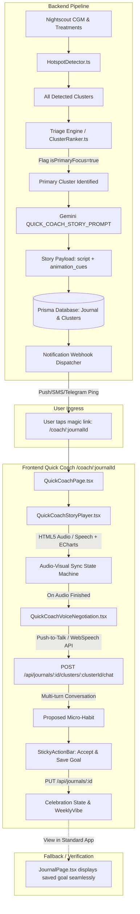
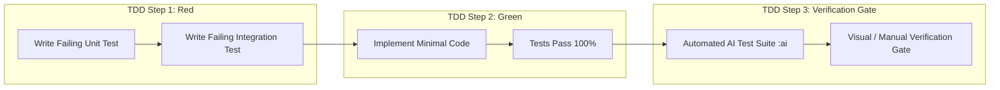

# Technical Design Document & Implementation Plan: Quick Coach (Minimum Viable Beta)

**Project:** GoodNumbers "Quick Coach" (Minimum Viable Beta)  
**Author:** Technical Lead & Architecture  
**Status:** Approved for Implementation  
**Date:** September 18, 2026

---

## 1. Executive Summary & Architecture Overview

The **Quick Coach** delivers an audio-visual glycemic story followed by a voice-negotiated goal setting session on a distraction-free mobile screen.

### System Architecture Diagram



---

## 2. Invariants, Assumptions & Architectural Guardrails

1. **Schema Simplicity:** Only one schema modification: `isPrimaryFocus Boolean @default(false)` added to `GlycemicEventCluster`. No new tables are introduced.
2. **Unified Data Model:** Both the standard dashboard and the Quick Coach share the exact same `Journal` and `GlycemicEventCluster` entities. Saving `goalsForNextWeek` updates the standard journal record.
3. **Strict Scope Boundaries:**
   - No modifications to `DashboardPage.tsx` or `PastJournalsList.tsx`.
   - No Service Worker or Web Push API (low-tech HTTP webhook ping with magic link).
4. **Strict TDD:** Every feature unit (Triage, Prompt parsing, Webhook, Audio Sync Machine, Voice Chat, Persistence) is implemented using Red $\to$ Green $\to$ Refactor.
5. **Mesa Design Tokens:** Frontend utilizes existing Mesa design tokens:
   - Primary Terracotta: `#D9775B`
   - Petrol Blue: `#2C4C5B`
   - Sand / Canvas: `#FBF9F5` / `#F3EFEA`
   - Coral High: `#E06A55`
   - Plum Low: `#8A4F7D`

---

## 3. Detailed Technical Specifications

### 3.1 Phase 1: Database Schema & Type Definitions

- **File:** `backend/prisma/schema.prisma`
  - Update `GlycemicEventCluster` model:
    ```prisma
    model GlycemicEventCluster {
      id                  String  @id @default(cuid())
      journalId           String
      eventType           String
      eventCount          Int
      meanTimeMinutes     Int
      isPrimaryFocus      Boolean @default(false)
      clusterDataJson     Json
      userNotes           String?
      insights            Json?
      aiInsight           Json?
      quickLogSuggestions Json?
      journal             Journal @relation(fields: [journalId], references: [id], onDelete: Cascade)
    }
    ```
- **Shared Types:** `packages/types/src/index.ts` & `packages/types/src/generated/client`
  - Re-generate Prisma Client and verify `isPrimaryFocus` type propagates.
  - Define `QuickCoachStoryPayload` interface:

    ```typescript
    export interface AnimationCue {
      time_ms: number;
      action: "DRAW_MEAN" | "DRAW_DAY" | "DRAW_TREATMENTS" | "HIGHLIGHT_WINDOW";
      day_index?: number;
      label?: string;
    }

    export interface QuickCoachStory {
      audio_script: string;
      animation_cues: AnimationCue[];
      audio_url?: string;
    }
    ```

---

### 3.2 Phase 2: Backend Triage Engine & Notification Webhook

#### 3.2.1 Triage Engine (`backend/src/lib/analysis/ClusterTriage.ts`)

Calculates clinical severity score for each cluster:

- **Scoring Function:**
  - Base Score:
    - `eventType === 'hypo'`: Base 100
    - `eventType === 'hyper'`: Base 40
  - Severity Modifiers:
    - Lowest minimum reading $< 54\text{ mg/dL}$: $+50$
    - Lowest minimum reading $< 70\text{ mg/dL}$: $+20$
    - Highest reading $> 250\text{ mg/dL}$: $+30$
    - Event Frequency: $+5 \times \text{eventCount}$
    - Nocturnal event (23:00 to 06:00): $+25$
- **Selection:** Sort clusters descending by severity score. The cluster with highest score receives `isPrimaryFocus = true`; all others receive `isPrimaryFocus = false`.

#### 3.2.2 Notification Webhook (`backend/src/lib/notifications/webhook.ts`)

- Dispatches HTTP POST or Telegram/Pushover webhook containing:
  - Magic Link URL: `${process.env.APP_BASE_URL || 'http://localhost:3000'}/coach/${journalId}`
  - Summary message: `"Your GoodNumbers Quick Coach is ready for this week! Take 2 minutes to review: ${coachUrl}"`
- Fails gracefully if webhook URL is not configured or offline without failing the journal job.

---

### 3.3 Phase 3: AI Audio-Visual Prompt & Story Generator

#### 3.3.1 Prompt Specification (`backend/src/lib/ai/prompts.ts`)

Create `QUICK_COACH_STORY_PROMPT`:

- Input: Primary `GlycemicCluster`, `GlucoseUnit`, `timezone`, deterministic insights, user weekly vibe.
- Output JSON Schema:
  ```json
  {
    "audio_script": "Let's take a quick look at your post-lunch pattern this week. Around 1:30 PM, we noticed consistent highs across four separate afternoons...",
    "animation_cues": [
      { "time_ms": 0, "action": "DRAW_MEAN", "label": "Average Pattern" },
      {
        "time_ms": 4000,
        "action": "DRAW_DAY",
        "day_index": 0,
        "label": "Monday"
      },
      {
        "time_ms": 7500,
        "action": "DRAW_TREATMENTS",
        "day_index": 0,
        "label": "Lunch Bolus"
      },
      {
        "time_ms": 11000,
        "action": "DRAW_DAY",
        "day_index": 1,
        "label": "Wednesday"
      },
      {
        "time_ms": 15000,
        "action": "DRAW_DAY",
        "day_index": 2,
        "label": "Thursday"
      }
    ]
  }
  ```

#### 3.3.2 Story Service (`backend/src/lib/ai/gemini.ts`)

- Implement `generateQuickCoachStory(...)` using Gemini Pro/Flash structured JSON output with Zod validation.
- Store story output within `cluster.aiInsight.quickCoachStory` or `clusterDataJson`.

---

### 3.4 Phase 4: Frontend Route & Standalone Shell Layout

- **Route:** `/coach/:journalId` in `frontend/src/App.tsx` (wrapped with `ProtectedRoute`).
- **Component:** `frontend/src/pages/QuickCoachPage.tsx`
  - **Layout:** Full-viewport mobile card (`min-h-screen bg-[#FBF9F5] flex flex-col justify-between p-4 max-w-lg mx-auto`).
  - **Data Fetch:** Calls `GET /api/journals/:id`.
  - **Cluster Extraction:** Finds `primaryCluster = journal.clusters.find(c => c.isPrimaryFocus) || journal.clusters[0]`.
  - **Header:** Minimal badge with "⚡ GoodNumbers Quick Coach" and date range.

---

### 3.5 Phase 5: Animated ECharts & Audio Sync Component

- **Component:** `frontend/src/components/coach/QuickCoachStoryPlayer.tsx`
- **Architecture:**
  - Custom ECharts instance overlaying 24-hour time or cluster window (X-axis: time offset from cluster start, Y-axis: glucose value).
  - Audio source: HTML5 `<audio>` element with Web Speech API / TTS fallback.
  - State Machine (`PlaybackState: 'idle' | 'playing' | 'paused' | 'completed'`):
    - `onTimeUpdate` event compares `audio.currentTime * 1000` with `animation_cues`.
    - Triggers series insertion:
      - `DRAW_MEAN`: Renders smooth spline of the mean cluster trajectory.
      - `DRAW_DAY`: Dynamically adds a new series representing `day_index` glucose trace with subtle color opacity.
      - `DRAW_TREATMENTS`: Adds ECharts `markPoint` annotations for insulin dosages and carb icons.
  - Interactive Scrubber & Replay controls.

---

### 3.6 Phase 6: Voice Negotiation & Micro-Habit Setting

- **Component:** `frontend/src/components/coach/QuickCoachVoiceNegotiation.tsx`
- **Workflow:**
  1. Once audio playback reaches `'completed'`, voice negotiation activates automatically (or with a single "Tap to speak" button).
  2. Integrates with Web Speech API (`webkitSpeechRecognition` / `SpeechRecognition`) with graceful text fallback.
  3. Uses existing endpoint `POST /api/journals/:id/clusters/:clusterId/chat` for conversational back-and-forth.
  4. Once a resolution is reached, Gemini formats a proposed micro-habit card:
     ```
     🎯 Weekly Micro-Habit:
     "Walk 10 minutes immediately after lunch on weekdays."
     ```

---

### 3.7 Phase 7: Handshake, Goal Persistence & Celebration

- **Components:** `StickyActionBar` & `QuickCoachSuccessModal.tsx`
- **Action:**
  - User clicks **"Accept & Save Goal"**.
  - Client executes `PUT /api/journals/:id` with `{ goalsForNextWeek: proposedGoal }`.
  - Transitions to celebration view with `WeeklyVibe` emojis, confetti animation, and confirmation.
  - Links to `/dashboard` or option to view full `/journal/:id`.

---

## 4. Test-Driven Development (TDD) Strategy & Verification Gates



### 4.1 Verification Gates by Task

| Task                             | Automated Verification Gate                                                          | Manual / Visual Verification Gate                                          |
| :------------------------------- | :----------------------------------------------------------------------------------- | :------------------------------------------------------------------------- |
| **Task 1: Schema & Types**       | `npm run test:backend:ai` passes Prisma validation                                   | Check `schema.prisma` migrations and generated TS types                    |
| **Task 2: Triage & Webhook**     | `vitest backend/tests/unit/analysis/ClusterTriage.test.ts`                           | Trigger worker job, check database `isPrimaryFocus` and webhook log        |
| **Task 3: Story Prompt & AI**    | `vitest backend/tests/unit/ai/quick_coach_story.test.ts`                             | Verify JSON cue structure and millisecond timestamps                       |
| **Task 4: Route & Page Shell**   | `vitest frontend/src/pages/__tests__/QuickCoachPage.test.tsx`                        | Visit `/coach/:id` in browser, verify clean mobile layout                  |
| **Task 5: ECharts & Audio Sync** | `vitest frontend/src/components/coach/__tests__/QuickCoachStoryPlayer.test.tsx`      | Play audio, visually observe traces stacking in real-time                  |
| **Task 6: Voice Chat & Habit**   | `vitest frontend/src/components/coach/__tests__/QuickCoachVoiceNegotiation.test.tsx` | Speak into mic, verify AI dialogue and micro-habit synthesis               |
| **Task 7: Persistence & Vibe**   | `vitest frontend/src/pages/__tests__/QuickCoachFlow.integration.test.tsx`            | Click "Accept & Save", navigate to `/journal/:id`, verify goal is rendered |
