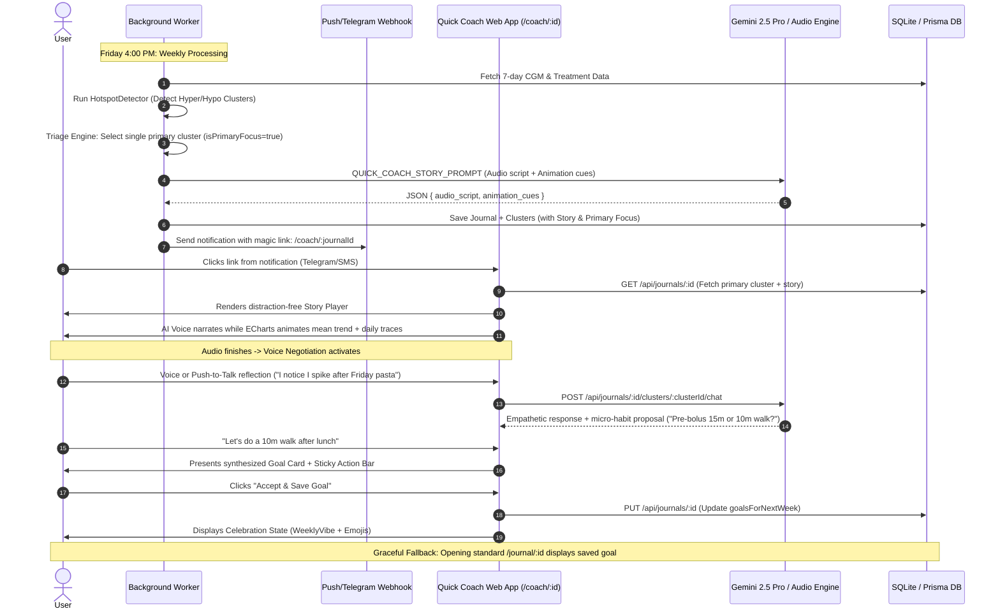

# Product Requirements Document (PRD): Quick Coach (Minimum Viable Beta)

**Project:** GoodNumbers "Quick Coach" (Minimum Viable Beta)  
**Target Audience:** Type 1 Diabetes (T1D) Patients & Clinicians  
**Author:** Product & Engineering  
**Status:** Approved for Implementation  
**Date:** September 18, 2026

---

## 1. Executive Summary

Living with Type 1 Diabetes involves making hundreds of extra micro-decisions every day and navigating overwhelming amounts of Continuous Glucose Monitor (CGM) data. This leads to **data fatigue** and burnout.

The **Quick Coach** is a targeted mobile-first experience designed to combat data fatigue. Instead of forcing users to analyze dozens of graphs across a 7-day period, the system:

1. Distills the week's data down to the **single most clinically significant glycemic cluster**.
2. Delivers a direct **magic link ping** to the user on Friday afternoon.
3. Plays an **audio-visual data story** where an AI voice narrates the pattern while an animated ECharts graph dynamically builds the trendline and daily traces.
4. Transitions into a **voice negotiation** session where the AI and user agree on one high-leverage micro-habit for the upcoming week.
5. Saves the negotiated goal into the standard weekly journal record seamlessly.

---

## 2. User Personas & Problem Statement

### Persona: Sarah (Active T1D Patient)

- **Pain Point:** Opens her CGM app and weekly reports, sees dozens of highs and lows across 7 days, feels overwhelmed, and closes the app without taking concrete action.
- **Desired Outcome:** Wants to spend less than 3 minutes on a Friday afternoon understanding the one thing that will move the needle next week without guilt or technical friction.

---

## 3. Core User Journey

---

## 4. Key Functional Requirements

### 4.1 Backend & Data Pipeline

- **FR-1 (Schema Flag):** `GlycemicEventCluster` model must support a boolean `isPrimaryFocus` flag (`@default(false)`).
- **FR-2 (Triage Algorithm):** Deterministically score all identified clusters based on clinical urgency:
  1. _Severe Hypoglycemia_ (readings < 54 mg/dL or long night hypos) — **Weight: 100**
  2. _Frequent Hypoglycemia_ (readings < 70 mg/dL, $\ge 3$ events) — **Weight: 80**
  3. _Extreme Hyperglycemia / Rebound Spikes_ (readings > 250 mg/dL post-hypo) — **Weight: 60**
  4. _Frequent Hyperglycemia_ (readings > 180 mg/dL post-meal) — **Weight: 40**
  5. Highest frequency / variance cluster if multiple share top tier.
- **FR-3 (Script & Cue Generation):** Generate a synchronized narrative JSON script containing timestamps (in milliseconds) and corresponding chart drawing cues (`DRAW_MEAN`, `DRAW_DAY`, `DRAW_TREATMENTS`).
- **FR-4 (Notification Ping):** Dispatch a webhook notification with the target link `https://[domain]/coach/:journalId` when journal processing completes.

### 4.2 Frontend Presentation & Interaction

- **FR-5 (Standalone Route):** Dedicated `/coach/:journalId` route that omits standard navigation headers/footers to maximize focus on mobile screens.
- **FR-6 (Audio-Visual Story Sync):** An ECharts canvas synchronized with an `<audio>` player or speech synthesis engine via timecode triggers.
- **FR-7 (Voice Reflection & Negotiation):** Microphone/Speech-to-Text interaction powered by Gemini via the existing cluster chat endpoint to settle on a single clear micro-habit.
- **FR-8 (One-Click Handshake):** "Accept & Save Goal" button in a `StickyActionBar` that saves the goal to the journal record without requiring full journal editing.
- **FR-9 (Unified Data Consistency):** Navigating to the standard `/journal/:id` displays the goal saved during the Quick Coach session.

---

## 5. Non-Functional Requirements & Guardrails

- **Response Time:** Page load and story readiness under 1.5 seconds on 4G mobile networks.
- **Tone & Persona:** Empathetic, non-judgmental, collaborative ("Specialist Data Analyst & Supportive Coach"). Never prescriptive, never shameful.
- **Accessibility:** Full text fallback for audio script; keyboard and text input fallbacks for voice recognition.
- **Zero Disruption to Existing Flows:**
  - `DashboardPage.tsx` and `PastJournalsList.tsx` remain untouched.
  - No service worker or web push complexity for the MVB.
  - No separate coaching session database tables.

---

## 6. Success Metrics & Verification

1. **Completion Rate:** $>85\%$ of users who open the `/coach/:id` link complete the goal handshake.
2. **Time to Complete:** Average session duration $< 150$ seconds.
3. **Data Integrity:** $100\%$ consistency between Quick Coach saved goals and standard `/journal/:id` view.

---

## 7. Related Specifications

- [Quick Coach Investigative Tool Calling PRD](../design/quick-coach-investigative-tools-prd.md): Comprehensive specification for Gemini function calling to query historical Nightscout data during conversational negotiation.
